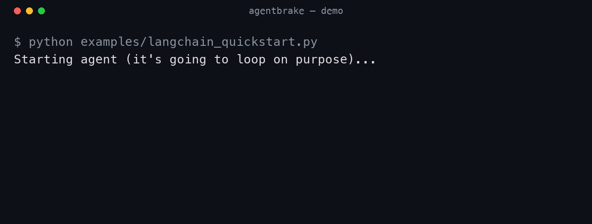

# Recording the AgentBrake demo

The money shot for every launch post is the no-API-key LangChain example: it
builds a real LangGraph agent that loops forever, and AgentBrake stops it at
step 3. `step 1 → 2 → 3 → 🛑 STOPPED — loop detected`. That's the pitch in five
seconds. Capture it once, reuse everywhere (HN, Reddit, X, the landing page).

## Setup (once)

```bash
cd ~/Projects/AgentBrake
uv venv .venv --python 3.12
uv pip install --python .venv/bin/python "agentbrake-sdk[langchain]" langchain
.venv/bin/python examples/langchain_quickstart.py   # confirm it brakes at step 3
```

## Option A — GIF with vhs (recommended, headless, repeatable)

[vhs](https://github.com/charmbracelet/vhs) renders a GIF from a script — no
screen recording, deterministic output. Needs `vhs` + `ffmpeg` + `ttyd`.

```bash
# with Homebrew: brew install vhs
# without brew: grab the vhs binary from its releases page, plus ffmpeg + ttyd
source .venv/bin/activate          # so `python` in the tape resolves to the venv
vhs demo/demo.tape                 # -> demo/agentbrake.gif
```

Tape lives at `demo/demo.tape` — tweak font/size/theme there.

## Option B — asciinema (terminal cast, embeddable, smallest effort)

```bash
pip install asciinema   # or: brew install asciinema
asciinema rec demo/agentbrake.cast \
  -c ".venv/bin/python examples/langchain_quickstart.py"
asciinema upload demo/agentbrake.cast    # gives you a shareable link + embed
```

Great for the GitHub README and HN comments; for X/Reddit, convert to GIF with
`agg` (asciinema's gif generator) or screen-record the playback.

## Option C — just screenshot it (zero tooling)

Run the example, screenshot the last ~8 lines (the `step 1/2/3` + the red
`🛑 STOPPED` + the stats line). A clean screenshot already converts; don't let
tooling block the launch.

## What the capture should show

```
[AgentBrake] step 1: search · running cost $0.0000
[AgentBrake] step 2: search · running cost $0.0000
[AgentBrake] step 3: search · running cost $0.0000
[AgentBrake] 🛑 STOPPED — loop detected: same tool call repeated 3× in a row
  steps=3 tool_calls=3 llm_calls=3 tokens=0 cost=$0.0000 elapsed=0.0s
✅ AgentBrake caught it: loop detected: same tool call repeated 3× in a row
```

Once you have `demo/agentbrake.gif`, drop it into the README near the top:

```markdown

```
